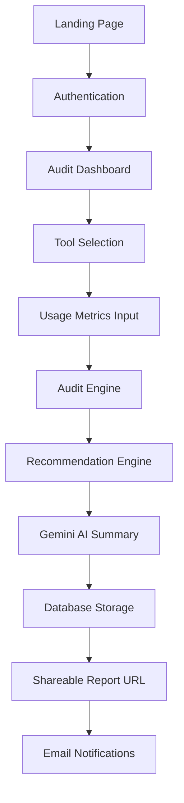

# ARCHITECTURE.md

# System Architecture

Audit.ai is a full-stack SaaS MVP focused on AI spend analysis and optimization.

## Architecture Overview

## Frontend
- React
- Tailwind CSS
- Context API
- LocalStorage

## Backend
- Node.js
- Express.js
- Supabase PostgreSQL

## AI Integration

Gemini API is used for:
- AI-generated summaries
- Recommendation explanations
- Audit analysis summaries

Core business logic remains deterministic and rule-based.

## Recommendation Logic

### Implemented Rules
- Team-size rules
- Duplicate tool detection
- Basic savings estimation

## Security
- JWT authentication
- Environment variables
- Input validation
- Public report sanitization
