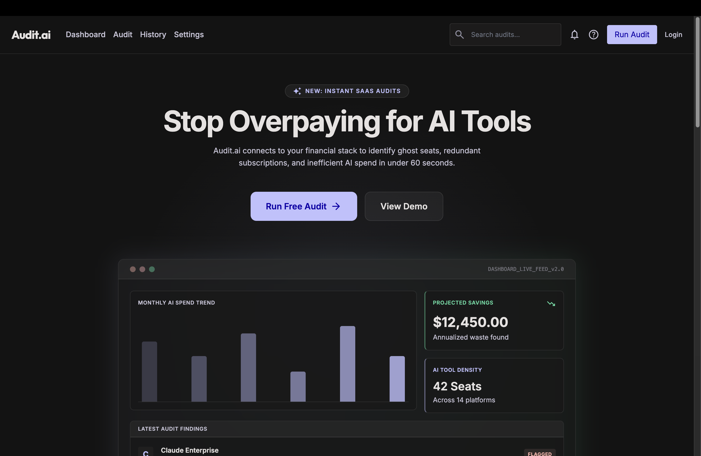
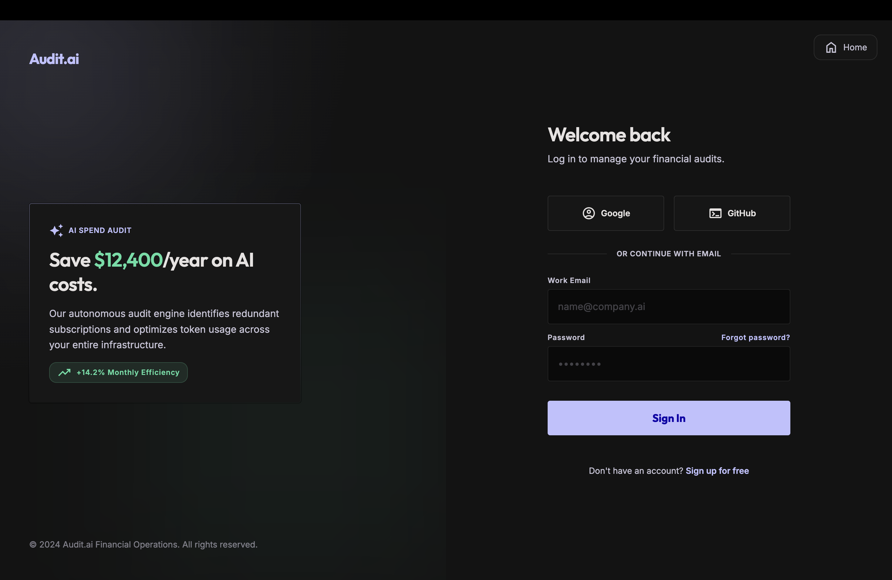
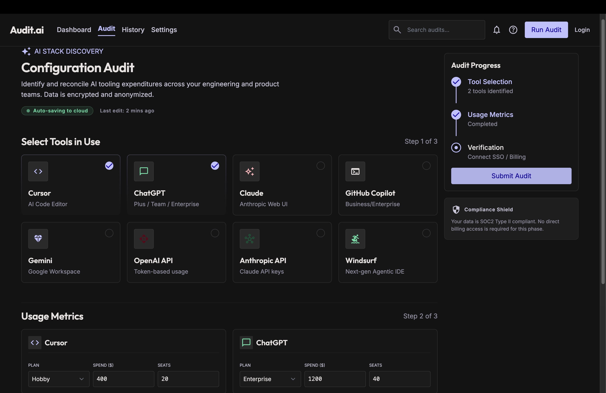

# Audit.ai

> Optimize AI spending. Reduce tool redundancy. Improve operational efficiency.

Audit.ai is an MVP-stage AI spend optimization platform designed for startups, engineering teams, and modern businesses using multiple AI tools simultaneously.

---

## 🚀 Features

- Landing page
- JWT authentication
- Audit dashboard
- Tool selection system
- Usage metrics form
- Savings calculations
- Recommendation engine
- LocalStorage persistence
- Backend storage
- AI-generated summaries using Gemini API
- Shareable URLs
- PDF export *(planned)*
- Email capture
- Email notifications using Resend

---

## 🛠 Tech Stack

| Layer | Technology |
|---------|-------------|
| Frontend | React |
| Styling | Tailwind CSS |
| Backend | Node.js + Express |
| Database | PostgreSQL (Supabase) |
| Authentication | JWT |
| AI Integration | Gemini API |
| Deployment | Vercel + Render |

---

## 📁 Folder Structure

```text
Audit.ai
│
├── frontend
│   └── src
│       ├── assets
│       ├── pages
│       ├── components
│       ├── context
│       ├── data
│       └── layout
│
├── backend
│   └── src
│       ├── config
│       ├── controllers
│       ├── middlewares
│       ├── services
│       ├── models
│       ├── routes
│       └── uploads
│
└── server.js
```

---

## 🧠 Current Audit Logic

The current MVP uses:

- Team-size rules
- Duplicate tool detection
- Percentage-based estimation
- Plan downgrade recommendations

---

## 🔗 Shareable URLs

```text
/audit/:uuid
```

Users can generate and share audit reports using unique URLs.

---

## 📊 Current Status

Audit.ai is currently an MVP prototype focused on validating AI spend optimization workflows and operational efficiency analysis.

---

# 📸 Screenshots

## 🏠 Home Page



The landing page introduces Audit.ai and allows users to start AI spend analysis.

---

## 🔐 Login Page



JWT-based authentication system for secure user access.

---

## 📈 Audit / Report Dashboard



Displays AI usage metrics, spending insights, recommendations, and estimated savings.

---

## ⚡ Installation

Clone the repository:

```bash
git clone https://github.com/yourusername/Audit.ai.git
```

Navigate into project:

```bash
cd Audit.ai
```

Install dependencies:

Frontend:

```bash
cd frontend
npm install
npm run dev
```

Backend:

```bash
cd backend
npm install
npm start
```

---

## Future Improvements

- PDF report export
- Team collaboration support
- More advanced AI recommendation engine
- Real-time analytics
- Multi-provider AI integrations
- Subscription billing support

---

## Author

Built with ❤️ using React, Node.js, PostgreSQL, and AI APIs.
